# Browser Home Pages

A themeable **new tab page** for Chrome, Edge, Brave and Firefox, with 17 themes and 26 widgets.

Each theme brings its own look, background effects (rain, stars, a neon grid, CRT scanlines…) and sometimes its own features (XP and gold, a breathing guide, Minesweeper…). Widgets can be dragged and resized, and every theme has an accent colour you can change. Your to-dos, notes and links stay the same whatever theme you use.

No dependencies and no build step: plain HTML, CSS and JavaScript modules.

---

## Preview

Every theme as it first appears, with its default layout. All of them can be rearranged, recoloured and mixed with any widget.

<table>
  <tr>
    <td width="50%" valign="top">
      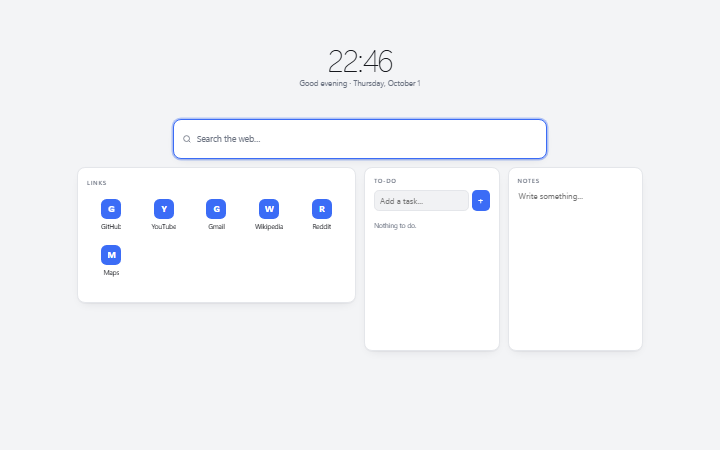<br>
      <b>Default</b><br>
      <sub>Clean and neutral. The fallback theme if another one fails to load.</sub>
    </td>
    <td width="50%" valign="top">
      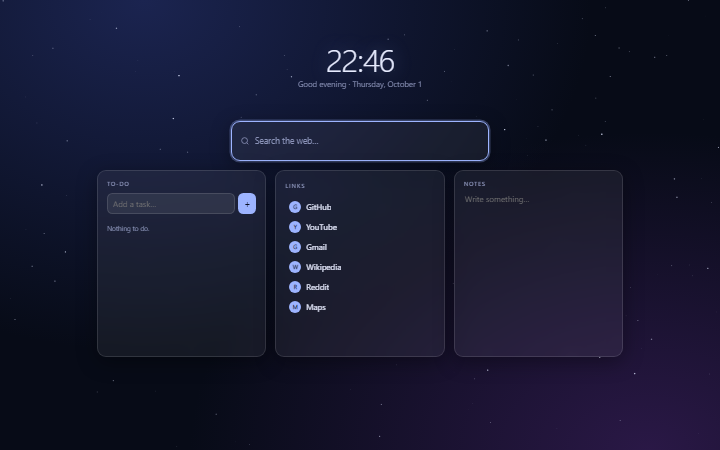<br>
      <b>Midnight</b><br>
      <sub>Dark sky with twinkling stars. Finishing a task launches a shooting star.</sub>
    </td>
  </tr>
  <tr>
    <td width="50%" valign="top">
      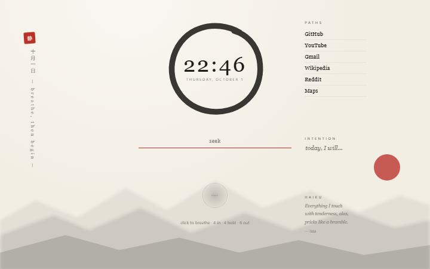<br>
      <b>Zen</b><br>
      <sub>Rice paper, ink-wash mountains and an ensō clock. Breathing guide, daily intention and a haiku.</sub>
    </td>
    <td width="50%" valign="top">
      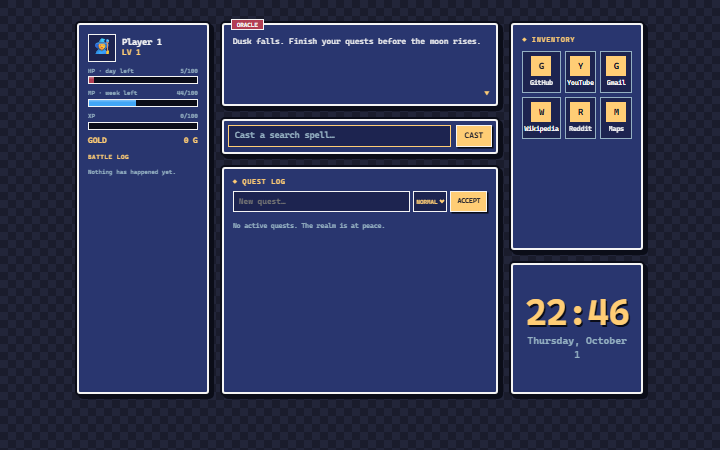<br>
      <b>RPG Quest</b><br>
      <sub>Pixel RPG. To-dos become quests that earn XP and gold, and you level up.</sub>
    </td>
  </tr>
  <tr>
    <td width="50%" valign="top">
      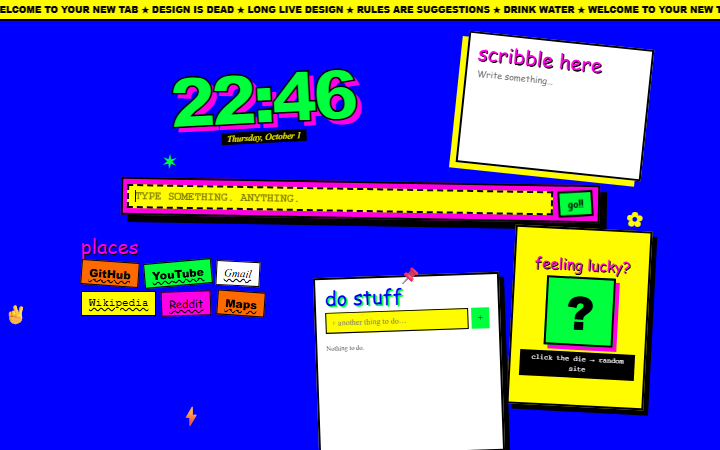<br>
      <b>Anti-Design</b><br>
      <sub>Clashing colours, mixed fonts, tilted blocks and a marquee ticker. Roll a die for a random site.</sub>
    </td>
    <td width="50%" valign="top">
      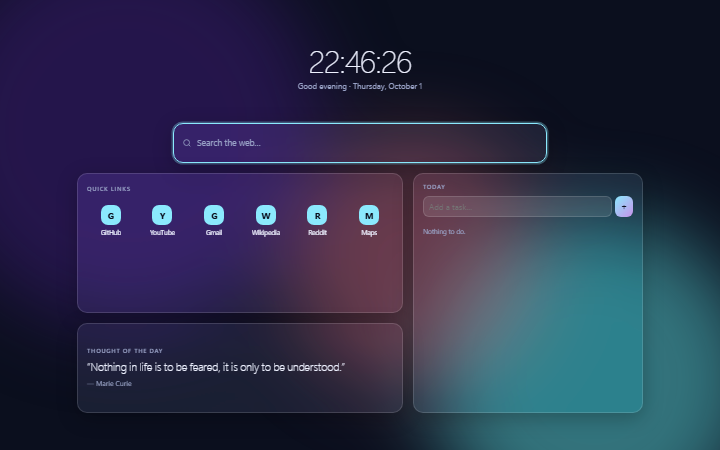<br>
      <b>Aurora Glass</b><br>
      <sub>Frosted-glass widgets over a slowly drifting aurora.</sub>
    </td>
  </tr>
  <tr>
    <td width="50%" valign="top">
      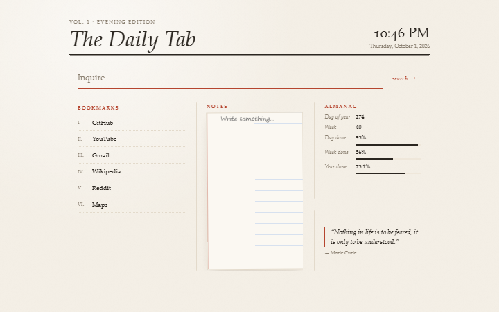<br>
      <b>Paper &amp; Ink</b><br>
      <sub>A newspaper front page: masthead, ruled columns, a lined notebook and an almanac.</sub>
    </td>
    <td width="50%" valign="top">
      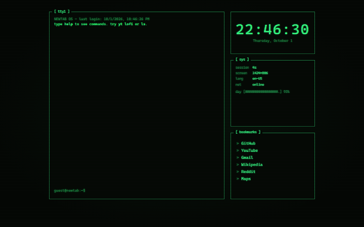<br>
      <b>Terminal</b><br>
      <sub>CRT phosphor console with a working command line. The accent colour is the phosphor colour.</sub>
    </td>
  </tr>
  <tr>
    <td width="50%" valign="top">
      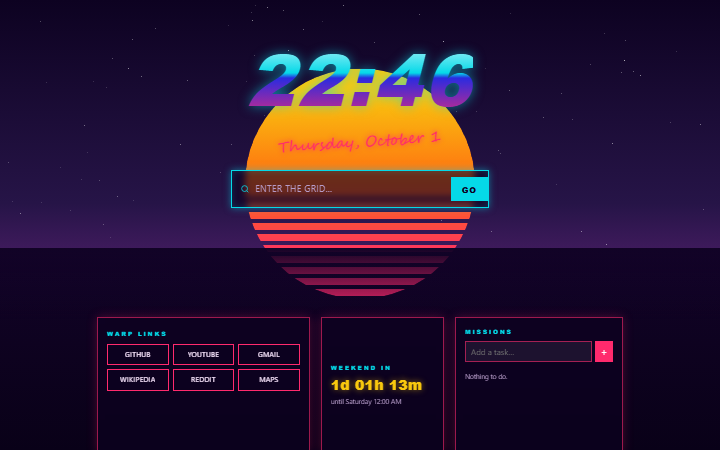<br>
      <b>Synthwave</b><br>
      <sub>80s neon sunset with a striped sun, an endless grid floor and a countdown to the weekend.</sub>
    </td>
    <td width="50%" valign="top">
      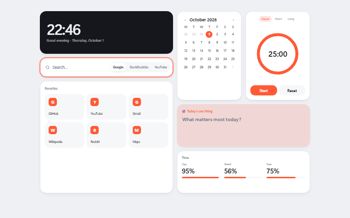<br>
      <b>Bento</b><br>
      <sub>Clean rounded tiles: calendar, pomodoro and progress bars. Follows your system's light/dark mode.</sub>
    </td>
  </tr>
  <tr>
    <td width="50%" valign="top">
      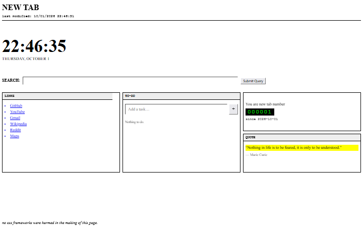<br>
      <b>Raw HTML</b><br>
      <sub>Browser defaults, Times, blue underlined links and a retro visitor-style tab counter.</sub>
    </td>
    <td width="50%" valign="top">
      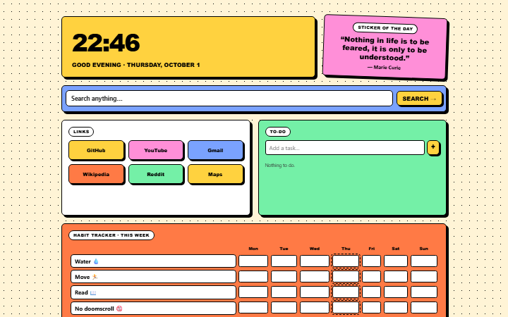<br>
      <b>Neo Brutal</b><br>
      <sub>Loud colour blocks, thick borders, hard shadows, buttons that press in, and a habit tracker.</sub>
    </td>
  </tr>
  <tr>
    <td width="50%" valign="top">
      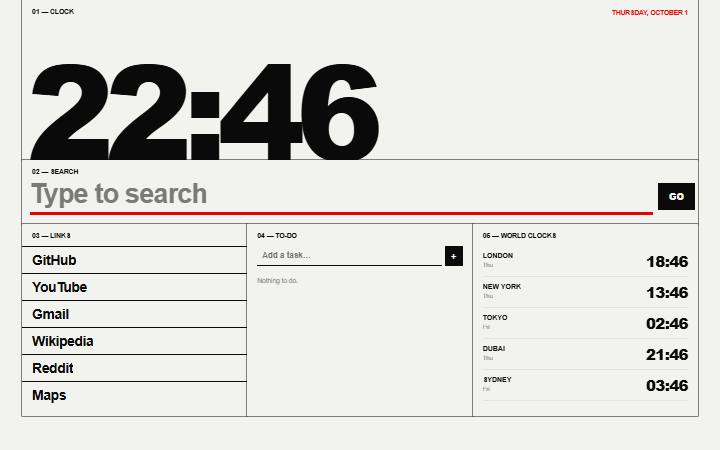<br>
      <b>Swiss Grid</b><br>
      <sub>Giant type on a strict ruled grid with numbered sections, in black, white and red. World clocks.</sub>
    </td>
    <td width="50%" valign="top">
      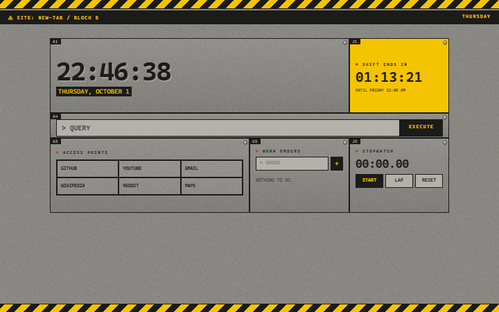<br>
      <b>Concrete</b><br>
      <sub>Raw concrete slabs, hazard tape and grid coordinates. A shift countdown and a stopwatch.</sub>
    </td>
  </tr>
  <tr>
    <td width="50%" valign="top">
      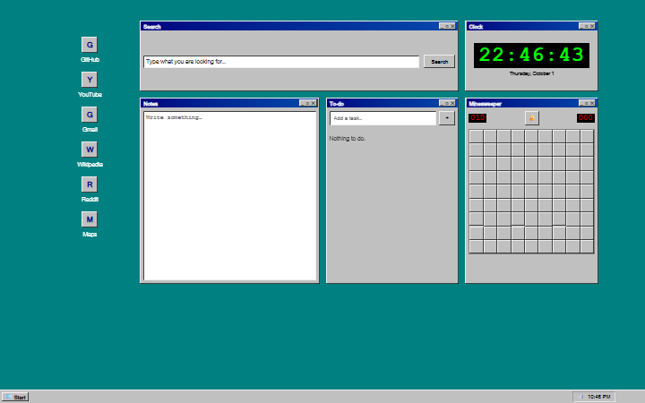<br>
      <b>Retro OS</b><br>
      <sub>A 90s desktop: every widget is a window, there's a taskbar, and Minesweeper is playable.</sub>
    </td>
    <td width="50%" valign="top">
      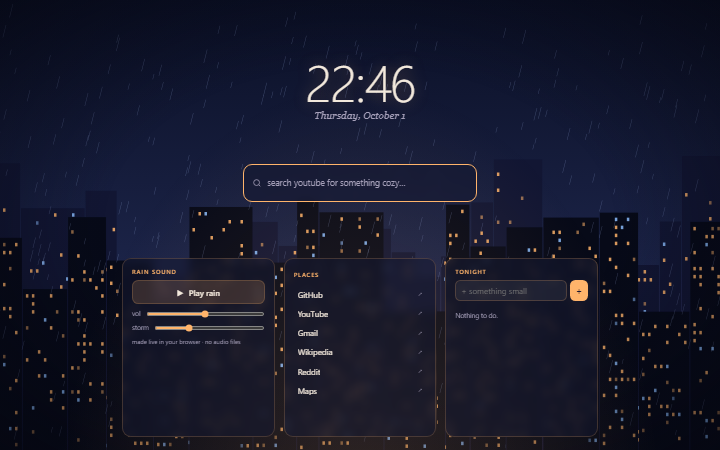<br>
      <b>Lo-fi Rain</b><br>
      <sub>Rain on the window and city lights, with rain sound generated live in the browser.</sub>
    </td>
  </tr>
  <tr>
    <td width="50%" valign="top">
      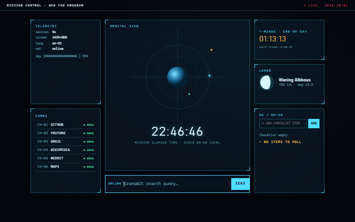<br>
      <b>Mission Control</b><br>
      <sub>Telemetry, an orbital view, the real moon phase and a GO/NO-GO checklist.</sub>
    </td>
    <td width="50%" valign="top">
      <br><br>
      <b>Your theme here</b><br>
      <sub>Copy <code>themes/_template/</code>, fill in the colours and layout, and add one line to <code>registry.json</code>. See <a href="#add-a-theme">Add a theme</a>.</sub>
    </td>
  </tr>
</table>

<sub>Previews are generated with <code>npm run previews</code>. Re-run it after changing how a theme looks.</sub>

---

## Install

It runs as a browser extension that replaces the new tab page. **Nothing has to be built or run first.**

**Chrome / Edge / Brave**
1. Open `chrome://extensions` (or `edge://extensions`, `brave://extensions`).
2. Turn on **Developer mode**.
3. Click **Load unpacked** and choose this folder.
4. Open a new tab.

It stays installed across restarts. After changing files, press **↻ reload** on the extension's card.

**Firefox**: `about:debugging` → *This Firefox* → *Load Temporary Add-on* → choose `manifest.json`. Temporary add-ons are removed when Firefox restarts. A permanent install needs the add-on signed by Mozilla (free, and an "unlisted" add-on isn't public).

**Also as your homepage or startup page**: open a new tab, copy its address (`chrome-extension://…/newtab.html`) and paste it into your browser's homepage/startup setting.

> `newtab.html` can't be opened directly from disk (`file://`): browsers block JavaScript modules there. Use it as an extension, or with the dev server below.

## Use

Press the **✦** button (bottom right) or **Alt+C** to open **Customize**:

| | |
|---|---|
| **Theme** | Switch between the 17 themes. Your data comes with you. |
| **Accent colour** | Pick a colour for this theme, or one for all themes. The theme's suggested colours are one click away, and a warning appears if your pick is hard to see. |
| **Edit layout** | Drag a widget's bar to move it, drag its corner to resize, ⚙ for its settings, ✕ to remove. Add any widget from the list. Each theme remembers its own layout. 🔒 marks slots a theme keeps fixed. |
| **Backup** | Export everything to a `.json` file and import it again (e.g. on another computer). |

Data is stored in the browser's own extension storage and is never sent anywhere. The only network requests are the ones you'd expect:
- search pages and the sites you open
- each link's icon, fetched directly from that site (turn off with the Links widget's "Letters only" setting)
- the **Feeling Lucky** widget's *The Useless Web* source: its site list from theuselessweb.com, about once a week, only after you allow it (asked on the first roll)
- the **Weather** widget: forecasts from [Open-Meteo](https://open-meteo.com), and the name of your location from [BigDataCloud](https://www.bigdatacloud.com/free-api/free-reverse-geocode-to-city-api). Coordinates are rounded to about 1 km first, and results are cached for 30 minutes. No API keys, no accounts. Remove the widget and no weather requests are made.

The extension asks for two permissions: **storage** (your settings) and **geolocation** (only used by the Weather widget's automatic location). Access to **theuselessweb.com** is optional and requested only if you use that source.

## Widgets

| Everyday | Theme-flavoured (usable in any theme) |
|---|---|
| Clock · Weather (your location or any place) · Search (9 engines or a custom one) · Links (with site icons) · To-do · Notes · Quote · Progress (day/week/month/year) · Calendar · Pomodoro · Countdown · World Clocks · Stopwatch · Moon Phase | Breathe · Intention · Haiku · Hero (XP, gold, levels) · Oracle · Feeling Lucky (your list or The Useless Web) · Terminal · System Info · Tab Counter · Habit Tracker · Minesweeper · Rain Sound · Orbit |

The to-do list is shared by every theme, and some themes show it differently: as a **quest log** in RPG Quest, or as a **GO/NO-GO checklist** in Mission Control.

---

## Develop

Needs [Node.js](https://nodejs.org) (any recent version) for the dev tools only. There are no packages to install.

```sh
npm run serve      # dev server → http://localhost:5173/newtab.html
                   #              http://localhost:5173/dev/gallery.html  (all themes side by side)
                   #              http://localhost:5173/demos/index.html  (original design mockups)
npm run check      # project rules: registry, contracts, imports, events, CSS, accent usage
npm test           # unit tests (Node's built-in runner)
npm run verify     # check + test (also run automatically before every commit)
npm run smoke      # drives the real app in headless Chrome/Edge (dev/smoke.html)
npm run previews   # regenerates docs/previews/*.png for this README
npm run update:uselessweb  # refreshes the bundled Useless Web fallback list
```

Useful URL parameters: `?theme=<id>` shows a theme without saving the choice, and `?preview` uses throw-away storage.

After cloning, run once:
```sh
git config core.hooksPath dev/hooks
git config user.name "Blankscreen-exe"
git config user.email "mhammad.hassan002@gmail.com"
```

### Add a theme

1. Copy `themes/_template/` to `themes/<your-id>/`.
2. In `theme.js`, set the id and name, fill in every colour token, set `accentRole` and design `defaultLayout`.
3. Style it in `theme.css`, inside `@layer theme` with every selector starting with `[data-theme="<your-id>"]`.
4. Add `{ "id": "<your-id>", "path": "themes/<your-id>/theme.js" }` to `registry.json`.
5. Run `npm run verify`, look at `dev/gallery.html`, then `npm run previews <your-id>`.

Widgets work the same way, starting from `widgets/_template/`.

### Project layout

```
manifest.json        extension manifest (MV3)
newtab.html          the only page
registry.json        installed themes + widgets
core/                small, stable engine: app, store + migrations, events, registry, grid,
                     theme manager, accent, ui, platform (the only file touching browser APIs)
providers/           adapters for online services (weather, geocoding), one file per service
themes/<id>/         theme.js + theme.css + README.md        (_template/ to start a new one)
widgets/core/<id>/   everyday widgets                         (_template/ to start a new one)
widgets/signature/   theme-flavoured widgets
dev/                 serve, check, tests, smoke test, previews, gallery, git hooks
docs/                CONTRACTS.md, MAINTAINING.md, decisions/, previews/
demos/               the original standalone design mockups
```

Before changing anything, read **[docs/MAINTAINING.md](docs/MAINTAINING.md)** (the project rules) and **[docs/CONTRACTS.md](docs/CONTRACTS.md)** (the theme and widget API). Changes are listed in **[CHANGELOG.md](CHANGELOG.md)**.
